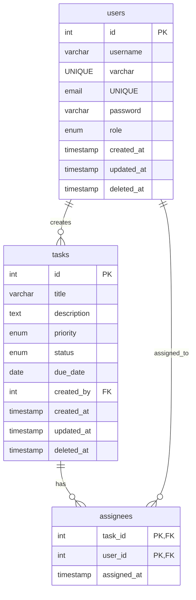

# Team Task Management System

A robust, modern, and high-performance full-stack web application designed for collaborative team task management. It features interactive status boards, drag-and-drop workflows, customizable team assignment filters, automatic calendar scheduling, and real-time productivity analytics for admins.

---

## Core Features

- **Admin Dashboard**:
  - Rich interactive analytics visualizer showing task completion metrics.
  - Interactive Doughnut Chart showing task status distributions (Open vs. In Progress vs. Done) using **Recharts**.
  - Bar Chart showing task completion velocity over the last 7 days.
  - Active welcome greeting matching user profile configuration.
- **Interactive Kanban Board**:
  - Seamless drag-and-drop interaction built with `@dnd-kit`.
  - Column sorting mechanisms (Due Date, Creation Date, Update Time, and Default).
  - Fine-grained search & filters (filter tasks by priority levels or timeframes).
- **Visual Task Scheduler (Calendar)**:
  - Clean monthly view displaying scheduled due dates.
  - Drill-down functionality allowing users to view complete details of each task.

- **Team Collaborator Hub**:
  - Live filter options to view "Users I Lead", "Users I Work With", or all teams.
  - Full profiles containing interactive user detail modals showing lead and collaborative duties.

- **Security & Roles**:
  - Strict JSON Web Token (JWT) authenticated api calls.
  - Secure bcrypt password hashing.
  - Dedicated admin role permissions, including permanent (force) deletion of tasks and access to global dashboard statistics.

- **Fluid Themes**:
  - Responsive Light, Dark, and System theme synchronizations.

---

## Tech Stack

### Frontend

- **Framework**: React 19 (TypeScript)
- **Bundler**: Vite
- **Styling**: Tailwind CSS v4.0 (utilizing `@tailwindcss/vite` plugin)
- **State Management**: React Contexts
  - [ThemeContext.tsx](frontend/src/context/ThemeContext.tsx)
  - [AuthContext.tsx](frontend/src/context/AuthContext.tsx)
  - [TaskContext.tsx](frontend/src/context/TaskContext.tsx)
- **Charts & Visualization**: Recharts
- **Drag and Drop**: `@dnd-kit/core` & `@dnd-kit/sortable`
- **Utility Libraries**: `date-fns`, `lucide-react`, `class-variance-authority`

### Backend

- **Runtime**: Node.js
- **Framework**: Express (v5)
- **Language**: TypeScript (compiled using `tsx` dev compiler)
- **Database client**: `mysql2/promise` (supporting asynchronous MySQL query execution)
- **Authentication & Security**: password hashing via `bcrypt` & Stateless authentication using `jsonwebtoken`

---

## Database Schema

The database uses a MySQL relational schema mapping users, tasks, and task assignees:



- **Indices & Optimization**:
  - `idx_tasks_status` on `tasks(status)`
  - `idx_tasks_priority` on `tasks(priority)`
  - `idx_tasks_due_date` on `tasks(due_date)`
  - `idx_assignees_user_id` on `assignees(user_id)`

---

## API Endpoints

All application routes are prefixed with `/api` except for the health check.

| Category   | Route                       | Method   | Access | Description                                       |
| ---------- | --------------------------- | -------- | ------ | ------------------------------------------------- |
| **System** | `/health`                   | `GET`    | Public | Returns server health and timestamp               |
| **Auth**   | `/api/auth/register`        | `POST`   | Public | Register new user account                         |
| **Auth**   | `/api/auth/login`           | `POST`   | Public | Login and obtain JWT token                        |
| **Auth**   | `/api/auth/users`           | `GET`    | User   | Get list of all registered users                  |
| **Auth**   | `/api/auth/users/:id`       | `GET`    | Admin  | Get user profile details by ID                    |
| **Auth**   | `/api/auth/dashboard/stats` | `GET`    | Admin  | Retrieve global workspace statistics              |
| **Tasks**  | `/api/tasks`                | `POST`   | User   | Create a new task                                 |
| **Tasks**  | `/api/tasks`                | `GET`    | User   | Retrieve tasks associated with current user       |
| **Tasks**  | `/api/tasks/:id`            | `GET`    | User   | Get full details of a specific task               |
| **Tasks**  | `/api/tasks/:id`            | `PUT`    | User   | Update a task's full details                      |
| **Tasks**  | `/api/tasks/:id/status`     | `PATCH`  | User   | Update a task's status (open, in_progress, done)  |
| **Tasks**  | `/api/tasks/:id/priority`   | `PATCH`  | User   | Update a task's priority (low, medium, high)      |
| **Tasks**  | `/api/tasks/:id`            | `DELETE` | User   | Soft-delete a task                                |
| **Tasks**  | `/api/tasks/:id/force`      | `DELETE` | Admin  | Permanently delete a task from the database       |
| **Teams**  | `/api/team`                 | `GET`    | User   | List all collaborative teams for the user         |
| **Teams**  | `/api/team/task/:id`        | `GET`    | User   | Retrieve team details assigned to a specific task |
| **Teams**  | `/api/team/user`            | `GET`    | User   | Get task groupings by user                        |

---

## Installation & Setup

### Prerequisites

- Node.js (v18+)
- MySQL Server (running locally or remotely)

---

### Step 1: Backend Setup & Environment Configuration

1. Navigate to the backend directory:
   ```bash
   cd backend
   ```
2. Install dependencies:
   ```bash
   npm install
   ```
3. Copy the example configuration to create your local `.env` file:
   ```bash
   cp .env.example .env
   ```
4. Edit the newly created `.env` file with your MySQL database credentials:
   ```env
   HOST=localhost
   PORT=3001
   DB_HOST=localhost
   DB_PORT=3306
   DB_USER=root
   DB_PASSWORD=your_mysql_password
   DB_NAME=task_manager
   IS_TESTING=false
   DB_NAME_TEST=task_manager_test
   JWT_SECRET=super_secret_development_key_123!
   ```

---

### Step 2: Running Database Migrations & Seeding

The application requires database structure setup and offers optional seed data to facilitate testing.

1. **Run migrations** to create tables and database indices:
   ```bash
   npx tsx src/db/migrate.ts
   ```
2. **Seed sample data** (generates 20 mock users, 50 tasks across June-August, and assignees):
   ```bash
   npx tsx src/db/seed.ts
   ```

---

### Step 3: Starting the Servers

#### Start the Backend API Server

Under the `backend` directory, run:

```bash
npm run dev
```

The backend server will launch at [http://localhost:3001](http://localhost:3001).

#### Start the Frontend React Client

1. Open a new terminal and navigate to the frontend directory:
   ```bash
   cd ../frontend
   ```
2. Install dependencies:
   ```bash
   npm install
   ```
3. Run the development server:
   ```bash
   npm run dev
   ```
   The client application will start at [http://localhost:3000](http://localhost:3000). All requests to `/api` are automatically proxied to the backend port.

---

### Step 4: Running Tests

The backend includes a comprehensive suite of integration and unit tests using Node's native test runner.

To run the backend tests:

1. Ensure the MySQL server is running.
2. In the `backend` directory, execute:
   ```bash
   npm run test
   ```

---

## Repository Structure

```text
task-manager/
├── backend/
│   ├── src/
│   │   ├── controllers/      # Route controllers (auth, tasks, teams)
│   │   ├── db/               # Database config, migration schema, seeds
│   │   ├── middleware/       # JWT Authentication & role protection
│   │   ├── routes/           # REST API endpoints mapping
│   │   ├── types/            # TypeScript declarations
│   │   ├── app.ts            # Express application initialization
│   │   └── server.ts         # Server entrypoint
│   └── test/                 # Test suites for controllers & app logic
├── frontend/
│   ├── src/
│   │   ├── components/       # Layouts, Modals, Cards, and UI elements
│   │   ├── context/          # State providers (Auth, Task, Theme)
│   │   ├── lib/              # Utility helpers & date functions
│   │   ├── pages/            # View components (Dashboard, Tasks, Teams, etc.)
│   │   ├── types/            # Type definitions
│   │   └── index.css         # Global styling & theme classes
│   ├── index.html            # Entrypoint template
│   └── vite.config.ts        # Vite configuration & api proxy
└── README.md                 # Project configuration & documentation
```

---

## Thought Process & Design Decisions

### 1. Relational Integrity vs. Performance

MySQL was selected over MongoDB due to the strict relational requirements of team operations.

- **Cascading Rules**: Relational structures enforce `ON DELETE CASCADE` constraints across task creators and task assignees. If a user is deleted, their created tasks are deleted, and tasks containing user assignments automatically cascade-delete references in the `assignees` junction table.
- **Indices**: Added indexes on task `status`, `priority`, `due_date`, and assignee `user_id` to prevent full-table scans when scaling database lookups.

### 2. Role-Based Access Isolation (RBAC)

Role separation is strictly enforced at the database query layer:

- In `taskController.ts`, when fetching tasks, users with the role `user` are restricted to retrieving tasks where they are either the creator or a listed assignee via a SQL `HAVING` constraint checking max credentials post-grouping.
- Admins bypass this constraint entirely to monitor and manage all system-wide tasks.
- For update, status patch, priority patch, and delete queries, resource ownership or assignment is verified on the backend before running operations, rejecting unauthorized attempts.

### 3. UI Responsiveness via Optimistic Updates

To match the speed of premium workspace applications, status and task changes are performed **optimistically**:

- The React client immediately updates the local task list state when a status transition or metadata change is triggered.
- An asynchronous request is fired to the backend in the background to apply changes.
- If the request fails (e.g. invalid permissions, DB exception, network timeout), the failure is caught, a user-friendly error is communicated, and the local UI state **rolls back** to the original task state values.

### 4. Accessible Dialog Controls

Rather than loading heavy legacy modal setups, we leverage the headless primitive `@base-ui/react/dialog` to implement modal states. This ensures robust accessibility out of the box, including focus trapping, keyboard navigation (`Escape` key containment), aria role configurations, and backdrop clicks for dismiss actions. The styling is layered with vanilla CSS animations and dynamic Tailwind CSS transitions.
